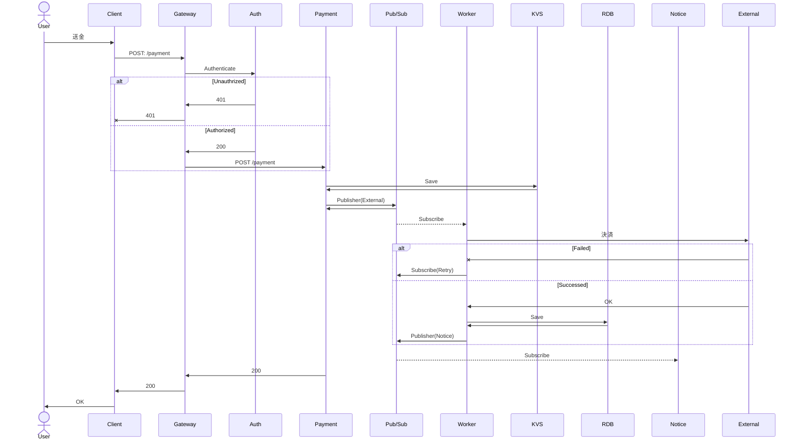

# paymock

本リポジトリは検証用です
スケールを想定した構成になっています

```mermaid
sequenceDiagram
    actor User
    participant Client
    participant Gateway
    participant Auth
    participant Payment
    participant Pub/Sub
    participant Worker
    participant KVS
    participant RDB
    participant Notice
    participant External

    User ->> Client: 送金
    Client ->> Gateway: POST: /payment
    Gateway ->> Auth: Authenticate

    alt Unauthrized
        Auth ->> Gateway: 401
        Gateway -x Client: 401
    else Authorized
        Auth ->> Gateway: 200
        Gateway ->> Payment: POST /payment
    end
    
    Payment ->> KVS: Save
    KVS ->> Payment: 

    Payment ->> Pub/Sub: Publisher(External)
    Pub/Sub ->> Payment: 
    Pub/Sub -->> Worker: Subscribe
    Worker ->> External: 決済
    alt Failed
        External -x Worker: 
        Worker ->> Pub/Sub: Subscribe(Retry)
    else Successed
        External ->> Worker: OK
        Worker ->> RDB: Save
        RDB ->> Worker: 
        Worker ->> Pub/Sub: Publisher(Notice)
    end

    Pub/Sub -->> Notice: Subscribe

    Payment ->> Gateway: 200
    Gateway ->> Client: 200
    Client ->> User: OK 
```
